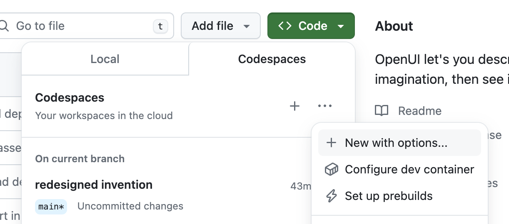
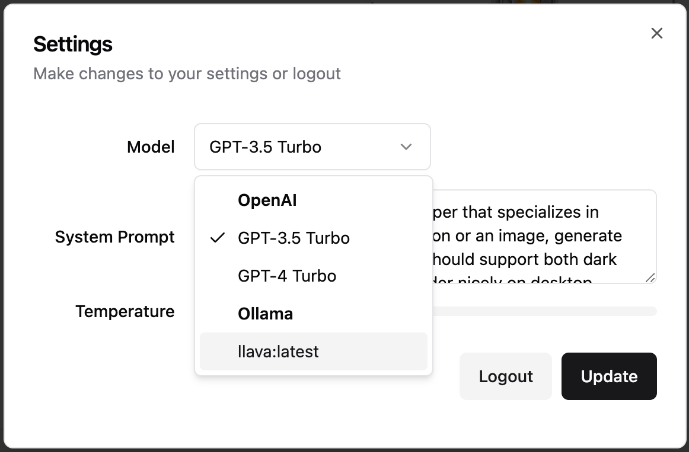

# OpenUI

<p align="center">
  
</p>

Building UI components can be a slog.  OpenUI aims to make the process fun, fast, and flexible.  It's also a tool we're using at [W&B](https://wandb.com) to test and prototype our next generation tooling for building powerful applications on top of LLM's.

## Overview


OpenUI let's you describe UI using your imagination, then see it rendered live.  You can ask for changes and convert HTML to React, Svelte, Web Components, etc.  It's like [v0](https://v0.dev) but open source and not as polished :stuck_out_tongue_closed_eyes:.

## Live Demo

[Try the demo](https://openui.fly.dev)

## Running Locally

OpenUI supports [OpenAI](https://platform.openai.com/api-keys), [Groq](https://console.groq.com/keys), and any model [LiteLLM](https://docs.litellm.ai/docs/) supports such as [Gemini](https://aistudio.google.com/app/apikey) or [Anthropic (Claude)](https://console.anthropic.com/settings/keys).  The following environment variables are optional, but need to be set in your environment for alternative models to work:

- **OpenAI** `OPENAI_API_KEY`
- **Groq** `GROQ_API_KEY`
- **Gemini** `GEMINI_API_KEY`
- **Anthropic** `ANTHROPIC_API_KEY`
- **Cohere** `COHERE_API_KEY`
- **Mistral** `MISTRAL_API_KEY`
- **OpenAI Compatible** `OPENAI_COMPATIBLE_ENDPOINT` and `OPENAI_COMPATIBLE_API_KEY`

For example, if you're running a tool like [localai](https://localai.io/) you can set `OPENAI_COMPATIBLE_ENDPOINT` and optionally `OPENAI_COMPATIBLE_API_KEY` to have the models available listed in the UI's model selector under LiteLLM.

### Ollama

You can also use models available to [Ollama](https://ollama.com).  [Install Ollama](https://ollama.com/download) and pull a model like [Llava](https://ollama.com/library/llava).  If Ollama is not running on http://127.0.0.1:11434, you can set the `OLLAMA_HOST` environment variable to the host and port of your Ollama instance.  For example when running in docker you'll need to point to http://host.docker.internal:11434 as shown below.

### Docker (preferred)

The following command would forward the specified API keys from your shell environment and tell Docker to use the Ollama instance running on your machine.

```bash
export ANTHROPIC_API_KEY=xxx
export OPENAI_API_KEY=xxx
docker run --rm --name openui -p 7878:7878 -e OPENAI_API_KEY -e ANTHROPIC_API_KEY -e OLLAMA_HOST=http://host.docker.internal:11434 ghcr.io/wandb/openui
```

Now you can goto [http://localhost:7878](http://localhost:7878) and generate new UI's!

### From Source / Python

Assuming you have git and [uv](https://github.com/astral-sh/uv) installed:

```bash
git clone https://github.com/wandb/openui
cd openui/backend
uv sync --frozen --extra litellm
source .venv/bin/activate
# Set API keys for any LLM's you want to use
export OPENAI_API_KEY=xxx
python -m openui
```

## LiteLLM

[LiteLLM](https://docs.litellm.ai/docs/) can be used to connect to basically any LLM service available.  We generate a config automatically based on your environment variables.  You can create your own [proxy config](https://litellm.vercel.app/docs/proxy/configs) to override this behavior.  We look for a custom config in the following locations:

1. `litellm-config.yaml` in the current directory
2. `/app/litellm-config.yaml` when running in a docker container
3. An arbitrary path specified by the `OPENUI_LITELLM_CONFIG` environment variable

For example to use a custom config in docker you can run:

```bash
docker run -n openui -p 7878:7878 -v $(pwd)/litellm-config.yaml:/app/litellm-config.yaml ghcr.io/wandb/openui
```

To use litellm from source you can run:

```bash
pip install .[litellm]
export ANTHROPIC_API_KEY=xxx
export OPENAI_COMPATIBLE_ENDPOINT=http://localhost:8080/v1
python -m openui --litellm
```

## Groq

To use the super fast [Groq](https://groq.com) models, set `GROQ_API_KEY` to your Groq api key which you can [find here](https://console.groq.com/keys).  To use one of the Groq models, click the settings icon in the nav bar.

### Docker Compose

> **DISCLAIMER:** This is likely going to be very slow.  If you have a GPU you may need to change the tag of the `ollama` container to one that supports it.  If you're running on a Mac, follow the instructions above and run Ollama natively to take advantage of the M1/M2.

From the root directory you can run:

```bash
docker-compose up -d
docker exec -it openui-ollama-1 ollama pull llava
```

If you have your OPENAI_API_KEY set in the environment already, just remove `=xxx` from the `OPENAI_API_KEY` line. You can also replace `llava` in the command above with your open source model of choice *([llava](https://ollama.com/library/llava) is one of the only Ollama models that support images currently)*.  You should now be able to access OpenUI at [http://localhost:7878](http://localhost:7878).

*If you make changes to the frontend or backend, you'll need to run `docker-compose build` to have them reflected in the service.*

## Development

A [dev container](https://github.com/wandb/openui/blob/main/.devcontainer/devcontainer.json) is configured in this repository which is the quickest way to get started.

### Codespace



Choose more options when creating a Codespace, then select **New with options...**.  Select the US West region if you want a really fast boot time.  You'll also want to configure your OPENAI_API_KEY secret or just set it to `xxx` if you want to try Ollama *(you'll want at least 16GB of Ram)*.

Once inside the code space you can run the server in one terminal: `python -m openui --dev`.  Then in a new terminal:

```bash
cd /workspaces/openui/frontend
npm run dev
```

This should open another service on port 5173, that's the service you'll want to visit.  All changes to both the frontend and backend will automatically be reloaded and reflected in your browser.

### Ollama

The codespace installs ollama automaticaly and downloads the `llava` model.  You can verify Ollama is running with `ollama list` if that fails, open a new terminal and run `ollama serve`.  In Codespaces we pull llava on boot so you should see it in the list.  You can select Ollama models from the settings gear icon in the upper left corner of the application.  Any models you pull i.e. `ollama pull llama` will show up in the settings modal.



### Gitpod

You can easily use Open UI via Gitpod, preconfigured with Open AI.

[](https://gitpod.io/#https://github.com/wandb/openui)

On launch Open UI is automatically installed and launched.

Before you can use Gitpod:

* Make sure you have a Gitpod account.
* To use Open AI models set up the `OPENAI_API_KEY` environment variable in your Gitpod [User Account](https://gitpod.io/user/variables). Set the scope to `wandb/openui` (or your repo if you forked it).

> NOTE: Other (local) models might also be used with a bigger Gitpod instance type. Required models are not preconfigured in Gitpod but can easily be added as documented above.

### Resources

See the readmes in the [frontend](./frontend/README.md) and [backend](./backend/README.md) directories.
